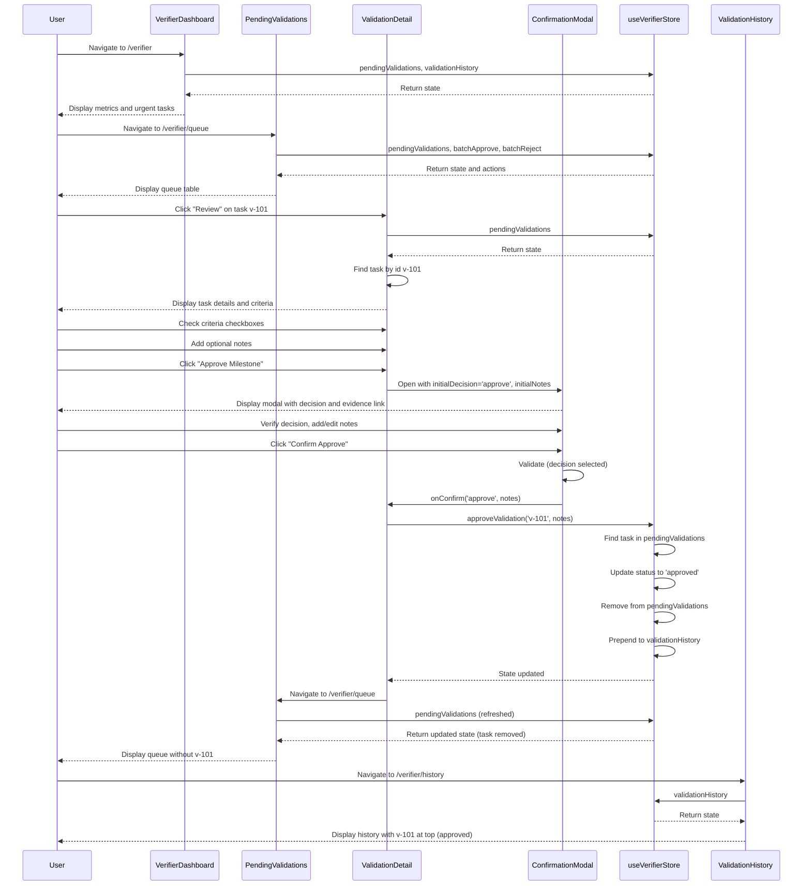

# Verifier Flow and useVerifierStore State Model

This document provides an end-to-end guide to the verifier experience in Disciplr, covering the ValidationTask data model, state lifecycle transitions, component interactions, and the ConfirmationModal approval/rejection flow.

## Table of Contents

- [Overview](#overview)
- [ValidationTask Data Model](#validationtask-data-model)
- [State Lifecycle](#state-lifecycle)
- [Component Architecture](#component-architecture)
- [Approval/Rejection Flow](#approvalrejection-flow)
- [Sequence Diagram](#sequence-diagram)
- [Store Consumption Patterns](#store-consumption-patterns)
- [Edge Cases and Error Handling](#edge-cases-and-error-handling)

---

## Overview

The verifier experience enables trusted reviewers to validate milestone submissions from vault owners. Verifiers review evidence, check criteria, and make approve/reject decisions that trigger on-chain transactions to release or lock vault funds.

The flow spans five main pages/components:

1. **VerifierDashboard** (`/verifier`) - Overview with metrics and quick access to pending/history
2. **PendingValidations** (`/verifier/queue`) - Full queue with filtering, sorting, and batch actions
3. **ValidationDetail** (`/verifier/queue/:vaultId`) - Detailed review of a single validation task
4. **ValidationHistory** (`/verifier/history`) - Historical log of all past decisions
5. **ConfirmationModal** - Reusable modal for final approve/reject confirmation

All state is managed by the `useVerifierStore` Zustand store defined in `src/Zustand/Store.ts`.

---

## ValidationTask Data Model

The `ValidationTask` type represents a single validation task that moves through the verifier workflow.

### Type Definition

```typescript
export type ValidationTask = {
  id: string;
  vaultName: string;
  owner: string;
  amount: string;
  deadline: string;
  daysRemaining: number;
  status: 'pending' | 'approved' | 'rejected';
  milestone: string;
  evidenceUrl?: string;
  notes?: string;
  criteria?: string[];
};
```

### Field Descriptions

| Field | Type | Description | Example |
|---|---|---|---|
| `id` | `string` | Unique identifier for the validation task | `'v-101'` |
| `vaultName` | `string` | Name of the vault associated with the validation | `'Q3 Development Fund'` |
| `owner` | `string` | Wallet address or identity of the vault owner | `'0x1234...abcd'` |
| `amount` | `string` | Formatted amount locked or requested | `'50,000 USDC'` |
| `deadline` | `string` | ISO date string representing the task deadline | `'2026-05-15'` |
| `daysRemaining` | `number` | Computed days remaining until the deadline | `16` |
| `status` | `'pending' \| 'approved' \| 'rejected'` | Current verification status | `'pending'` |
| `milestone` | `string` | Name or description of the milestone | `'Beta Release Deployment'` |
| `evidenceUrl` | `string` (optional) | URL pointing to validation evidence | `'https://github.com/example/release-v1'` |
| `notes` | `string` (optional) | Explanatory notes provided by the verifier during decision | `'Audit looks solid, all critical issues addressed.'` |
| `criteria` | `string[]` (optional) | Array of specific requirements that must be verified | `['Deployment URL is live', 'All critical bugs resolved']` |

### Example ValidationTask

```typescript
{
  id: 'v-101',
  vaultName: 'Q3 Development Fund',
  owner: '0x1234...abcd',
  amount: '50,000 USDC',
  deadline: '2026-05-15',
  daysRemaining: 16,
  status: 'pending',
  milestone: 'Beta Release Deployment',
  evidenceUrl: 'https://github.com/example/release-v1',
  criteria: [
    'Deployment URL is live and publicly accessible',
    'All critical bugs from the backlog are resolved',
    'Release notes are published',
  ],
}
```

---

## State Lifecycle

The `ValidationTask` status follows a linear lifecycle: `pending` → `approved` or `rejected`.

### Status States

1. **`pending`**
   - Task is in the `pendingValidations` queue
   - Awaiting verifier review and decision
   - Displayed in VerifierDashboard and PendingValidations pages
   - Can be reviewed in ValidationDetail page

2. **`approved`**
   - Task has been approved by a verifier
   - Moved from `pendingValidations` to `validationHistory`
   - Triggers on-chain transaction to release vault funds
   - Displayed in ValidationHistory with green status chip

3. **`rejected`**
   - Task has been rejected by a verifier
   - Moved from `pendingValidations` to `validationHistory`
   - Notifies vault owner to revise and resubmit
   - Funds remain locked in the vault
   - Displayed in ValidationHistory with red status chip

### State Transition Flow

```
┌─────────────────┐
│   pending       │
│ (in queue)     │
└────────┬────────┘
         │
         │ approveValidation() / rejectValidation()
         │
    ┌────┴────┐
    │         │
    ▼         ▼
┌──────┐  ┌──────┐
│approved│  │rejected│
│(history)│  │(history)│
└───────┘  └───────┘
```

### Store State Arrays

The store maintains two arrays:

- **`pendingValidations: ValidationTask[]`** - Contains all tasks with `status: 'pending'`
- **`validationHistory: ValidationTask[]`** - Contains all tasks with `status: 'approved'` or `'rejected'`, ordered by most recent first

---

## Component Architecture

### 1. VerifierDashboard (`src/pages/VerifierDashboard.tsx`)

**Route:** `/verifier`

**Purpose:** High-level overview with metrics and navigation to pending/history.

**Store Consumption:**
```typescript
const { pendingValidations, validationHistory } = useVerifierStore();
```

**Key Features:**
- Displays total assigned, pending count, and completed count
- Shows up to 3 urgent pending validations (sorted by days remaining)
- Shows up to 5 recent decisions from validation history
- Navigation buttons to queue and history pages
- Empty state handling when no pending validations exist

**Metrics Display:**
```typescript
const totalPending = pendingValidations.length;
const totalCompleted = validationHistory.length;
const totalAssigned = totalPending + totalCompleted;
```

### 2. PendingValidations (`src/pages/PendingValidations.tsx`)

**Route:** `/verifier/queue`

**Purpose:** Full queue view with filtering, sorting, and batch operations.

**Store Consumption:**
```typescript
const { pendingValidations, validationHistory, batchApprove, batchReject } = useVerifierStore();
```

**Key Features:**
- Table view of all pending validations
- Search by vault name or owner
- Filter by milestone
- Sort by urgency (days remaining ascending/descending)
- Multi-select checkboxes for batch actions
- Batch approve/reject via ConfirmationModal
- VerifierMetricsBar for queue statistics
- Empty states for "all caught up" and "no results found"
- CountdownDeadline component for each task

**Batch Action Flow:**
1. User selects one or more tasks via checkboxes
2. User clicks "Approve Selected" or "Reject Selected"
3. ConfirmationModal opens with `affectedCount` set
4. User confirms decision and adds notes
5. `batchApprove()` or `batchReject()` is called with selected IDs
6. Tasks transition from pending to history

### 3. ValidationDetail (`src/pages/ValidationDetail.tsx`)

**Route:** `/verifier/queue/:vaultId`

**Purpose:** Detailed review of a single validation task.

**Store Consumption:**
```typescript
const { pendingValidations, approveValidation, rejectValidation } = useVerifierStore();
```

**Key Features:**
- Displays full vault information (name, owner, amount, deadline)
- Shows milestone and evidence link
- Criteria checklist (all must be checked to enable approve button)
- Optional notes textarea for initial review notes
- Approve/Reject buttons that open ConfirmationModal
- Navigation back to queue
- "Validation Not Found" state if task ID doesn't exist in pending queue

**Criteria Gate:**
The approve button is disabled unless all criteria checkboxes are checked:
```typescript
const gateOpen = isCriteriaGateOpen(task.criteria, checkedCriteria);
// Approve button disabled when gateOpen is false
```

**Single Task Flow:**
1. User navigates to detail page for a specific task
2. User reviews evidence and checks criteria
3. User adds optional notes
4. User clicks Approve or Reject
5. ConfirmationModal opens with task details
6. User confirms decision
7. `approveValidation()` or `rejectValidation()` is called
8. Task transitions from pending to history
9. User is redirected back to queue

### 4. ValidationHistory (`src/pages/ValidationHistory.tsx`)

**Route:** `/verifier/history`

**Purpose:** Historical log of all past validation decisions.

**Store Consumption:**
```typescript
const { validationHistory } = useVerifierStore();
```

**Key Features:**
- Stats banner showing total, approved, rejected, and approval rate
- Filters: search query, date range, milestone, status (all/approved/rejected)
- Pagination (5, 10, 25 per page)
- Export to CSV functionality
- Displays verification notes for each decision
- Empty states for "No History Found" and "No matching validations"

**Stats Calculation:**
```typescript
const total = validationHistory.length;
const approvedCount = validationHistory.filter((t) => t.status === 'approved').length;
const rejectedCount = validationHistory.filter((t) => t.status === 'rejected').length;
const approvalRate = total > 0 ? Math.round((approvedCount / total) * 100) : 0;
```

### 5. ConfirmationModal (`src/components/ConfirmationModal.tsx`)

**Purpose:** Reusable modal for final approve/reject confirmation with notes.

**Props:**
```typescript
interface ConfirmationModalProps {
  isOpen: boolean;
  onClose: () => void;
  onConfirm: (decision: 'approve' | 'reject', notes: string) => void;
  initialDecision?: 'approve' | 'reject';
  initialNotes?: string;
  evidenceUrl?: string;
  affectedCount?: number; // For batch actions
}
```

**Key Features:**
- Decision selection (Approve/Reject buttons)
- Warning message about irreversible on-chain consequences
- Evidence link display (if provided)
- Notes textarea (required for rejection, optional for approval)
- Batch count display (when `affectedCount` is set)
- Accessibility features (focus trapping, escape key support, ARIA labels)

**Validation Rules:**
- Reject requires notes to be provided
- Approve can proceed without notes
- Confirm button is disabled until decision is selected and (if reject) notes are provided

---

## Approval/Rejection Flow

### Single Task Approval/Rejection

1. **Navigate to Task**
   - From VerifierDashboard: Click "Review Now" on a pending task
   - From PendingValidations: Click "Review" button on a task row
   - Route: `/verifier/queue/:vaultId`

2. **Review Evidence**
   - View vault summary (name, owner, amount, deadline)
   - Click evidence link to review submitted proof
   - Check milestone criteria checkboxes (all required for approval)

3. **Add Notes**
   - Optionally add initial review notes in the textarea
   - These notes are passed to the ConfirmationModal as `initialNotes`

4. **Initiate Decision**
   - Click "Approve Milestone" or "Reject Milestone"
   - ConfirmationModal opens with `initialDecision` and `initialNotes`

5. **Confirm in Modal**
   - Verify decision selection (can change if needed)
   - Review warning message about on-chain consequences
   - Add or edit notes (required for rejection)
   - Click "Confirm Approve" or "Confirm Reject"

6. **Store Mutation**
   - Modal calls `onConfirm(decision, notes)`
   - Component calls `approveValidation(id, notes)` or `rejectValidation(id, notes)`
   - Store locates task by ID in `pendingValidations`
   - Task status is updated to `'approved'` or `'rejected'`
   - Task is removed from `pendingValidations` array
   - Task is prepended to `validationHistory` array
   - If ID not found, operation is a no-op

7. **Redirect**
   - User is redirected to `/verifier/queue`
   - Task no longer appears in pending queue
   - Task now appears in validation history

### Batch Approval/Rejection

1. **Select Tasks**
   - Navigate to `/verifier/queue`
   - Check individual task checkboxes or "Select All"
   - Selected IDs are tracked in `selectedIds` state

2. **Initiate Batch Action**
   - Click "Approve Selected" or "Reject Selected" in sticky batch bar
   - ConfirmationModal opens with `affectedCount={selectedIds.length}`

3. **Confirm in Modal**
   - Verify batch count display
   - Select approve or reject decision
   - Add notes (applied to all tasks in batch)
   - Click confirm button

4. **Store Mutation**
   - Modal calls `onConfirm(decision, notes)`
   - Component calls `batchApprove(ids, notes)` or `batchReject(ids, notes)`
   - Store iterates through each ID and calls single-task mutator
   - Each task transitions from pending to history
   - Unknown IDs are silently ignored (no-op)

5. **Clear Selection**
   - `selectedIds` is cleared
   - Modal closes
   - Queue refreshes with remaining pending tasks

---

## Sequence Diagram

The following sequence diagram illustrates the complete flow of reviewing a pending task, confirming the decision, and moving it to history.



---

## Store Consumption Patterns

### Recommended: Slice Selection

Components should select only the state slices they need to avoid unnecessary re-renders:

```typescript
// Good: Only re-renders when pendingValidations changes
const pendingValidations = useVerifierStore((state) => state.pendingValidations);

// Good: Actions are stable references, never cause re-renders
const approveValidation = useVerifierStore((state) => state.approveValidation);

// Good: Multiple selections in one hook call
const { pendingValidations, approveValidation } = useVerifierStore((state) => ({
  pendingValidations: state.pendingValidations,
  approveValidation: state.approveValidation,
}));
```

### Avoid: Full Store Destructuring

```typescript
// ⚠️ Avoid: Re-renders on any store change
const { pendingValidations, approveValidation } = useVerifierStore();
```

### Component-Specific Patterns

**VerifierDashboard:**
```typescript
const { pendingValidations, validationHistory } = useVerifierStore();
```

**PendingValidations:**
```typescript
const { pendingValidations, validationHistory, batchApprove, batchReject } = useVerifierStore();
```

**ValidationDetail:**
```typescript
const { pendingValidations, approveValidation, rejectValidation } = useVerifierStore();
```

**ValidationHistory:**
```typescript
const { validationHistory } = useVerifierStore();
```

---

## Edge Cases and Error Handling

### Unknown Task ID

When a task ID is not found in `pendingValidations`:

- **ValidationDetail**: Displays "Validation Not Found" state with navigation back to queue
- **approveValidation/rejectValidation**: Operation is a no-op, state unchanged
- **batchApprove/batchReject**: Unknown IDs are silently ignored, other IDs processed normally

### Empty Queue States

- **VerifierDashboard**: Shows "You have no pending validations at this time" message
- **PendingValidations**: Shows "All caught up! There are no pending validations in your queue" message
- **ValidationHistory**: Shows "No History Found. You haven't processed any validations yet" message

### Empty Filter Results

- **PendingValidations**: Shows "No results found. No validations match your search filters" message
- **ValidationHistory**: Shows "No matching validations. Adjust the outcome filter or search query" message

### Criteria Gate Not Open

- **ValidationDetail**: Approve button is disabled when not all criteria are checked
- Visual feedback: Button appears muted with `cursor: not-allowed`
- Rejection is always available regardless of criteria

### Missing Evidence URL

- **ValidationDetail**: Shows "No evidence link provided" in italic muted text
- **ConfirmationModal**: Evidence link section is hidden when `evidenceUrl` is undefined

### Rejection Without Notes

- **ConfirmationModal**: Confirm button is disabled when decision is 'reject' and notes are empty
- Validation message: "Notes are required for rejection" appears in red
- Approval can proceed without notes

### Batch Edge Cases

- **Empty selection**: Batch action buttons are disabled when `selectedIds` is empty
- **Empty IDs array**: `batchApprove([])` and `batchReject([])` are safe no-ops
- **Mixed valid/invalid IDs**: Valid IDs are processed, invalid IDs are ignored

---

## Related Documentation

- [STORES.md](./STORES.md) - Detailed Zustand store contracts and mutator specifications
- [README.md](../README.md) - Project overview and route map
- [design-system/documentation/](../design-system/documentation/) - Design system guidance for confirmation modals and UI components

---

## Implementation Reference

All verifier-related code is located in:

- **Store**: `src/Zustand/Store.ts` - `useVerifierStore` and `ValidationTask` type
- **Pages**: `src/pages/VerifierDashboard.tsx`, `src/pages/PendingValidations.tsx`, `src/pages/ValidationDetail.tsx`, `src/pages/ValidationHistory.tsx`
- **Components**: `src/components/ConfirmationModal.tsx`
- **Tests**: `src/pages/__tests__/VerifierDashboard.test.tsx`, `src/pages/__tests__/PendingValidations.test.tsx`, `src/pages/__tests__/ValidationDetail.test.tsx`, `src/pages/__tests__/ValidationHistory.test.tsx`, `src/components/__tests__/ConfirmationModal.test.tsx`
